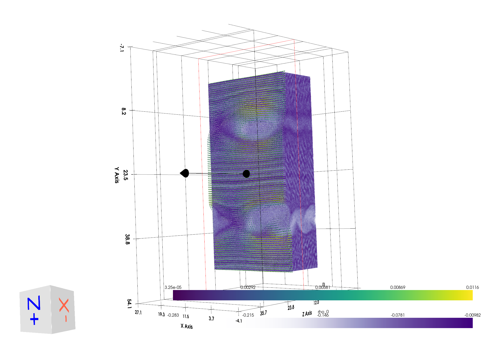
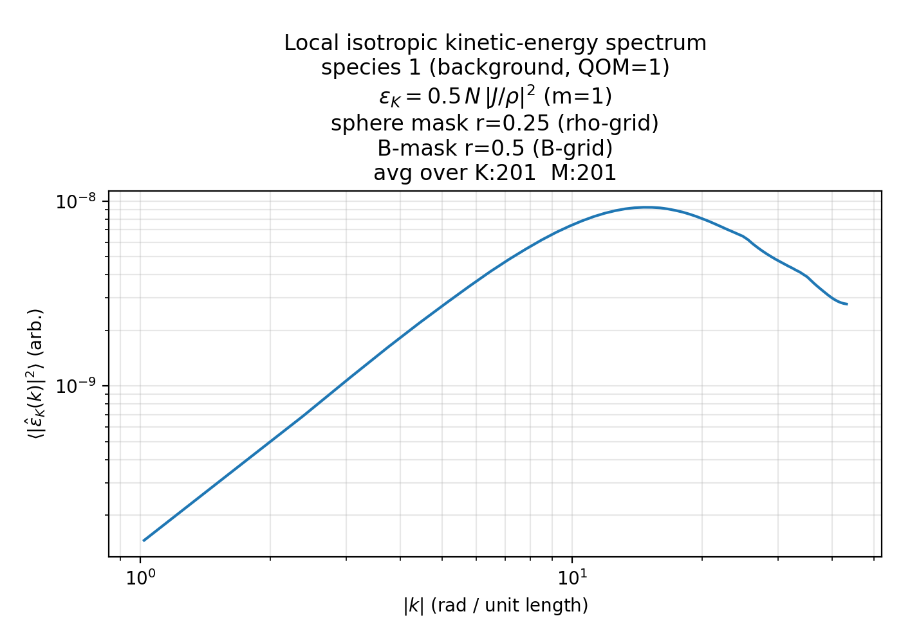
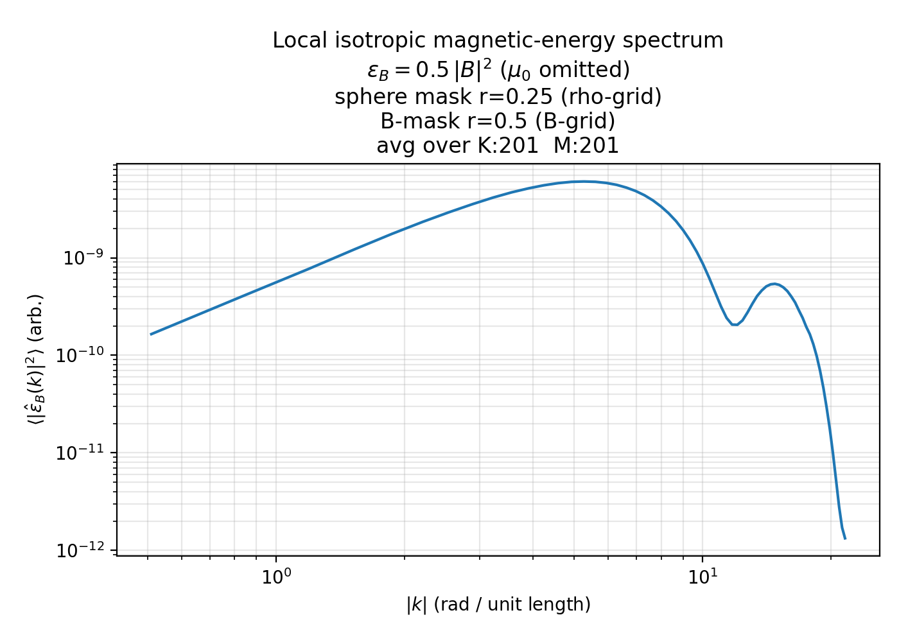
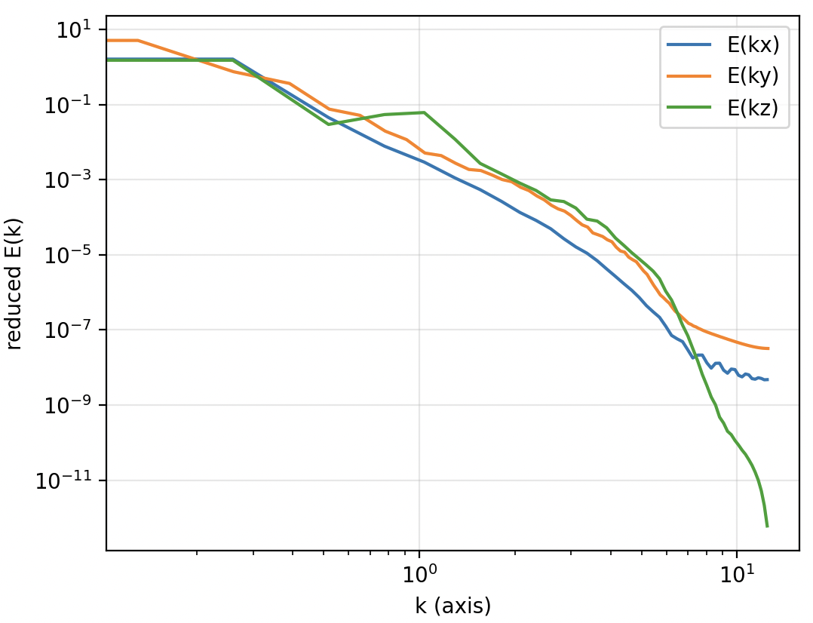
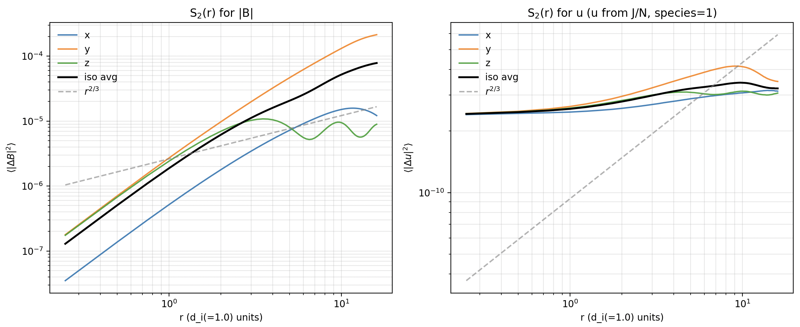
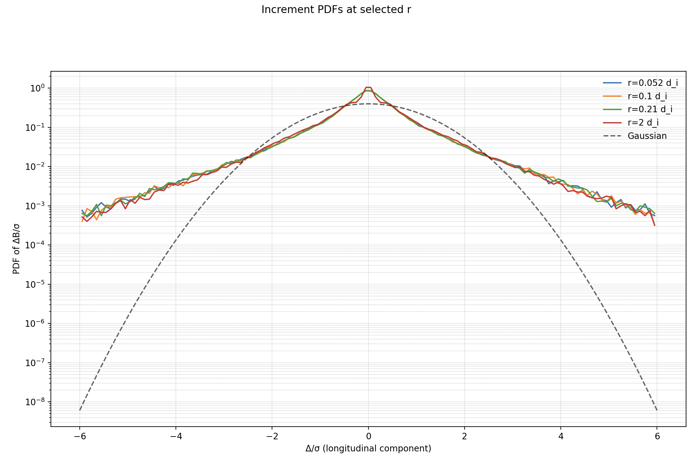

# iPIC3D / ECSIM 3D Visualization and Analysis Toolkit

This repository provides a collection of Python-based tools for **visualization**, **synthetic diagnostics**, and **post-processing analysis** of three-dimensional plasma simulation data produced by **iPIC3D / ECSIM**.

The toolkit is designed to support research on:

- Magnetic reconnection in kinetic and semi-implicit PIC simulations  
- Plasma turbulence and multiscale dynamics  
- Comparison between numerical simulations and in-situ spacecraft observations  

with an emphasis on physical transparency, minimal dependencies, and direct use of ECSIM HDF5 outputs.

---

## Project Structure

```
ipic3d_viz_toolkit/
│
├── 2nd_order_sf/        # Second-order structure functions and turbulence diagnostics
├── 3d_interactive/     # Interactive 3D field visualization
├── 3d_spectra/         # Magnetic and kinetic energy spectra
├── beta_anisotropy/   # Plasma beta and pressure anisotropy diagnostics
├── flyby_probes/      # Synthetic spacecraft probe trajectories
├── live_flyby/        # Live flyby visualization with slices and field glyphs
└── README.md
```

Each module contains standalone scripts together with a dedicated Markdown file describing:

- the physical quantities being computed  
- the numerical methodology  
- implementation details and assumptions  

---

## Objectives

The main objectives of this toolkit are:

- To enable rapid and intuitive exploration of fully 3D plasma simulations  
- To provide synthetic diagnostics mimicking spacecraft measurements  
- To extract spectral and statistical measures relevant to reconnection and turbulence  
- To facilitate reproducible and transparent analysis workflows  

Typical applications include:

- Characterization of reconnection-driven turbulence  
- Energy cascade and anisotropy studies  
- Heating and energization diagnostics  
- Qualitative and quantitative comparison with MMS-like observations  

---

## Requirements

Most tools rely on standard scientific Python packages:

```bash
pip install numpy h5py matplotlib pyvista
```

Some scripts may additionally require:

```bash
pip install scipy
```

---

## Basic Usage

Each subdirectory contains one or more executable scripts.

Example:

```bash
cd iso_spectra
python iso_b_spectra.py
```

or

```bash
cd live_flyby
python live_flyby_slice_glyphs.py
```

Input file paths, grid parameters, species indices, and numerical options (e.g. stride, resolution, averaging) are specified at the top of each script.

Refer to the accompanying `.md` documentation in each folder for detailed explanations.

---

## Example Outputs

### 3D Field Visualization



---

### Live Flyby Diagnostics

<video controls>
  <source src="./figures/out.mp4" type="video/mp4">
</video>

### Kinetic Energy Spectrum (along probe path)



### Magnetic Energy Spectrum (along probe path)



---

### Isotropic Energy Spectra



---

### Structure Functions



### PDF



---

## License

This project is released under the **MIT License**.

```
MIT License

Copyright (c) 2026

Permission is hereby granted, free of charge, to any person obtaining a copy
of this software and associated documentation files (the "Software"), to deal
in the Software without restriction, including without limitation the rights
to use, copy, modify, merge, publish, distribute, sublicense, and/or sell
copies of the Software, and to permit persons to whom the Software is
furnished to do so, subject to the following conditions:

The above copyright notice and this permission notice shall be included in all
copies or substantial portions of the Software.

THE SOFTWARE IS PROVIDED "AS IS", WITHOUT WARRANTY OF ANY KIND.
```

---

## Citation

If you use this toolkit in a publication, please cite it as:

```
Felipe Nathan de Oliveira Lopes, "iPIC3D / ECSIM 3D Visualization and Analysis Toolkit",
GitHub repository, 2026.
@ZENODO_DOI
```

You may also wish to cite the relevant simulation framework:

- Stefano Markidis, Giovanni Lapenta, Rizwan-uddin, *Multi-scale simulations of plasma with iPIC3D*, Mathematics and Computers in Simulation, Volume 80, Issue 7, 2010.

- https://kth-hpc.github.io/iPIC3D/

---

## Notes

- All quantities are expressed in **simulation (code) units** unless explicitly stated otherwise.  
- Absolute spectral normalization may depend on FFT conventions and windowing procedures.

---

## Contributing

Contributions are welcome, including:

- new diagnostics and analysis modules  
- performance improvements (and bugs corrections)
- documentation enhancements  
- visualization extensions  

Please open an issue or pull request.

---

## Contact

felipenathan.deoliveiralopes@kuleuven.be

